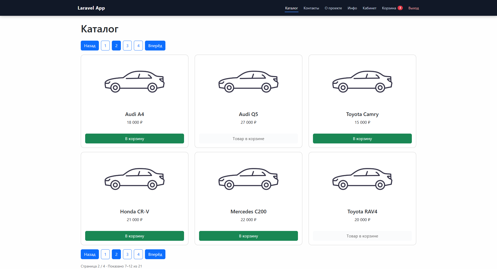

# Car Marketplace Platform

Современная fullstack-платформа для продажи и управления автомобилями, построенная на разделенной архитектуре frontend/backend.

Проект реализует каталог автомобилей, корзину, оформление заказов, личный кабинет пользователей и административную панель управления.

---

# Основные возможности



## Пользовательская часть

- каталог автомобилей;
- просмотр детальной информации об автомобилях;
- поддержка характеристик и опций;
- корзина и оформление заказов;
- история заказов;
- регистрация и авторизация;
- личный кабинет пользователя;
- загрузка аватара;
- контактная форма;
- динамические контентные страницы.

---

## Административная часть

- управление автомобилями;
- создание и редактирование каталога;
- управление заказами;
- управление профилем;
- разграничение ролей пользователей;
- защищенные разделы dashboard.

---

# Технологии

## Backend

Backend построен на :contentReference[oaicite:0]{index=0}.

Используемые подходы:

- REST API;
- API versioning (`API/V1`);
- DTO pattern;
- Repository pattern;
- Service layer;
- middleware architecture;
- role-based access control;
- Laravel Sanctum authentication.

---

## Frontend

Frontend реализован на :contentReference[oaicite:1]{index=1} + :contentReference[oaicite:2]{index=2} с использованием TypeScript.

Основные особенности:

- SPA architecture;
- Composition API;
- state management;
- middleware protection;
- reusable UI components;
- API service layer;
- SSR-ready структура.

---

# Архитектура проекта

```text
backend/   -> Laravel API
frontend/  -> Nuxt frontend
```

Проект использует API-first подход, что позволяет:

- подключать мобильные приложения;
- масштабировать frontend независимо от backend;
- интегрировать внешние сервисы;
- развивать публичное API.

---

# Основные сущности системы

- Users
- Cars
- Car Options
- Cart
- Orders
- Pages
- Contacts

---

# Безопасность

Реализовано:

- token authentication;
- middleware authorization;
- role-based access;
- protected routes;
- API validation.

---

# Дополнительно

- мультиязычность (`ru`, `en`);
- feature tests;
- seeders и factories;
- готовность к production deployment;
- масштабируемая структура проекта.

---

# Стек проекта

## Backend

- PHP
- Laravel
- Sanctum
- SQLite/MySQL

## Frontend

- Nuxt 3
- Vue 3
- TypeScript

---

# Назначение проекта

Проект может использоваться как:

- онлайн-автосалон;
- e-commerce платформа;
- automotive marketplace;
- MVP для startup;
- корпоративная система управления автомобилями.

