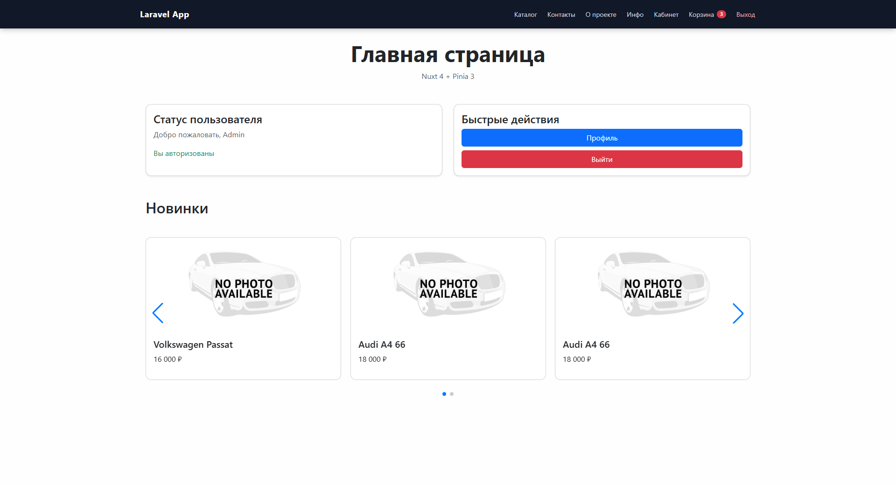
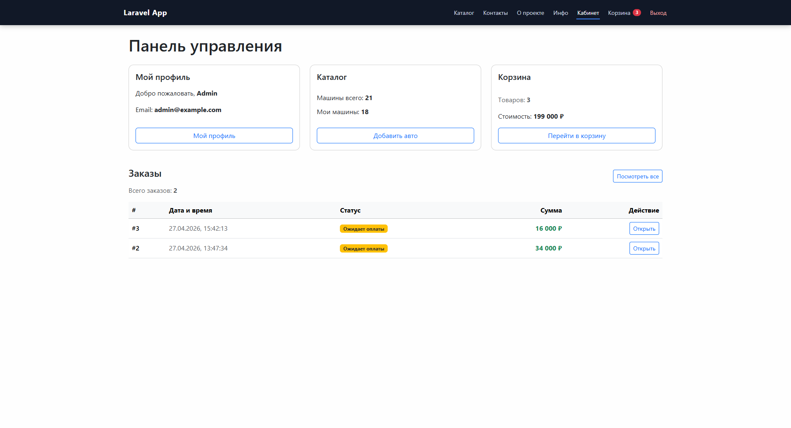
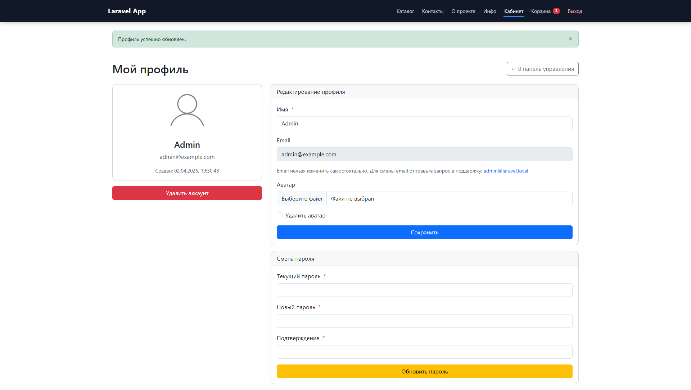
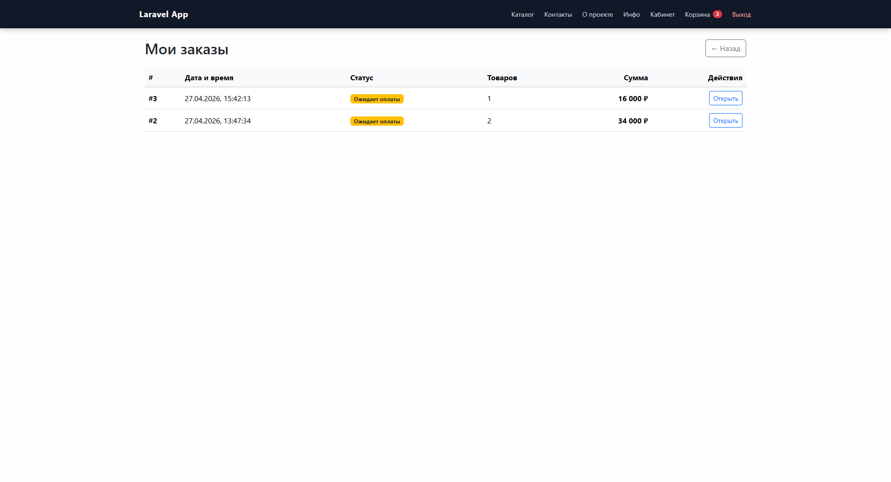
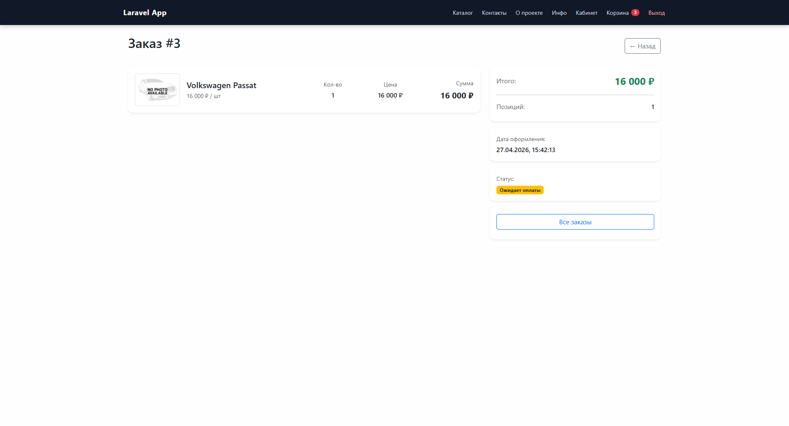
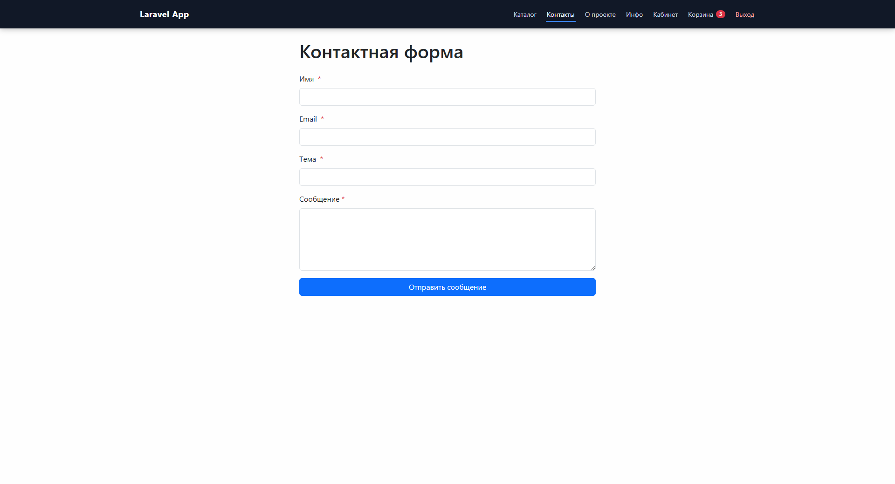
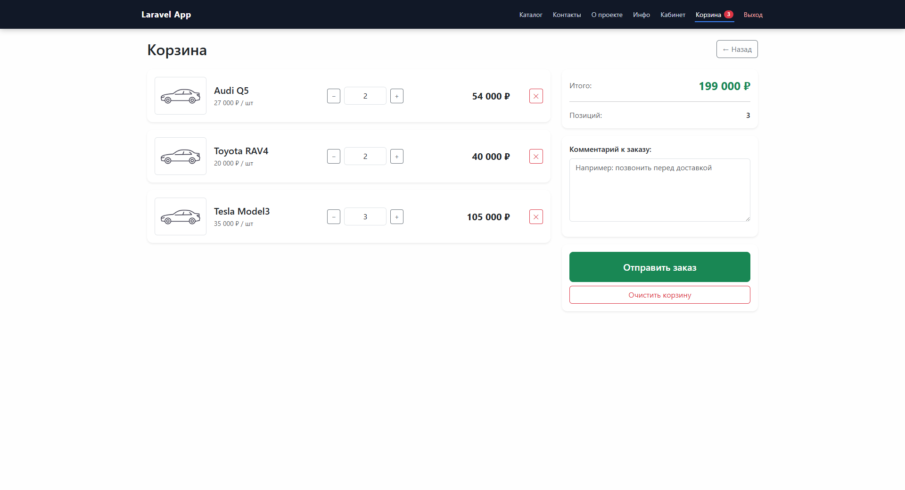

# Тестовый demo-проект

Использованные технологии:

* Laravel 13 (backend)
* Nuxt.js 4 (frontend)
* TypeScript
* Pinia
* Vue
* SSR/SPA

Проект написан с нуля и реализует каталог автомобилей, корзину, оформление заказов, личный кабинет пользователей и административную панель управления.

> Важно:
> Данный проект является тестовым/demo home-project и создан в образовательных целях.
> Не рекомендуется использовать проект в production без дополнительного аудита безопасности, оптимизации и доработок.
> Использование осуществляется на ваш собственный риск.

---

# Главная страница



---

# Каталог автомобилей

Полноценный каталог автомобилей с карточками, изображениями, характеристиками и переходом к детальной странице автомобиля.


---

# Панель управления

Защищенная dashboard-зона с навигацией по пользовательским разделам.



---

# Профиль пользователя

Личный кабинет пользователя:

* редактирование профиля;
* загрузка аватара;
* смена пароля;
* управление аккаунтом.



---

# Заказы

История оформленных заказов пользователя.



---

# Детальная информация о заказе

Страница просмотра конкретного заказа с товарами и общей информацией.



---

# Контакты

Контактная форма для обратной связи.



---

# Корзина

Поддерживается:

* добавление товаров;
* изменение количества;
* удаление товаров;
* оформление заказа;
* модальные окна подтверждения действий.



---

# Основные возможности

## Пользовательская часть

* каталог автомобилей;
* просмотр детальной информации об автомобилях;
* поддержка характеристик и опций;
* корзина и оформление заказов;
* история заказов;
* регистрация и авторизация;
* личный кабинет пользователя;
* загрузка аватара;
* контактная форма;
* динамические контентные страницы.

---

## Административная часть

* управление автомобилями;
* создание и редактирование каталога;
* управление заказами;
* управление профилем;
* разграничение ролей пользователей;
* защищенные разделы dashboard.

---

# Технологии

## Backend

Backend построен на Laravel.

Используемые подходы:

* REST API;
* API versioning (`API/V1`);
* DTO pattern;
* Repository pattern;
* Service layer;
* middleware architecture;
* role-based access control;
* Laravel Sanctum authentication.

---

## Frontend

Frontend реализован на Nuxt + Vue с использованием TypeScript.

Основные особенности:

* SPA architecture;
* Composition API;
* state management;
* middleware protection;
* reusable UI components;
* API service layer;
* SSR-ready структура.

---

# Архитектура проекта

```text
backend/   -> Laravel API
frontend/  -> Nuxt frontend
```

Проект использует API-first подход, что позволяет:

* подключать мобильные приложения;
* масштабировать frontend независимо от backend;
* интегрировать внешние сервисы;
* развивать публичное API.

---

# Основные сущности системы

* Users
* Cars
* Car Options
* Cart
* Orders
* Pages
* Contacts

---

# Безопасность

Реализовано:

* token authentication;
* middleware authorization;
* role-based access;
* protected routes;
* API validation.

---

# Дополнительно

* мультиязычность (`ru`, `en`);
* feature tests;
* seeders и factories;
* готовность к production deployment;
* масштабируемая структура проекта.

---

# Стек проекта

## Backend

* PHP
* Laravel
* Sanctum
* SQLite / MySQL

## Frontend

* Nuxt 4
* Vue 3
* Pinia
* TypeScript
* Bootstrap 5

---

# Назначение проекта

Проект может использоваться как:

* онлайн-автосалон;
* e-commerce платформа;
* automotive marketplace;
* MVP для startup;
* корпоративная система управления автомобилями.
